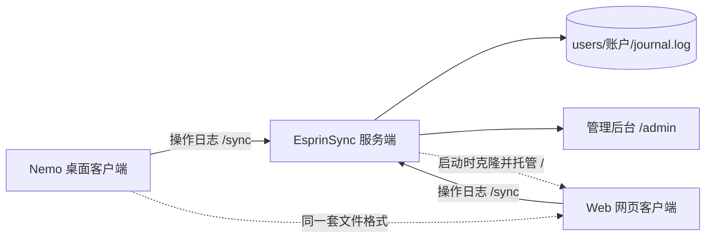

> Note, Nothing.

本地优先的笔记应用与配套服务。无账号体系，无云端托管：数据是用户磁盘上的 Markdown 文件，可由任意编辑器直接打开，整个数据目录复制一份即为一次完整备份。

除手动配置的自建同步与 AI 助手，以及可在设置中关闭的更新检查外，客户端不发起任何网络请求。

## 仓库

| 仓库 | 内容 | 形态 |
| --- | --- | --- |
| [Nemo](https://github.com/EsprinProject/Nemo) | 桌面客户端：笔记、待办、随口记（系统本机语音识别）、小本本、AI 助手、自建同步客户端、自动更新 | Electron + 原生 HTML / CSS / JavaScript；产出 Windows 安装包与便携版 |
| [Sync](https://github.com/EsprinProject/Sync) | 自建同步服务端：多账户、操作日志、可复用 ID、令牌鉴权、管理后台，并托管网页版客户端 | 单个 Python 文件（仅标准库）加管理页静态文件 |
| [Web](https://github.com/EsprinProject/Web) | 网页客户端：界面与桌面版现代布局逐条对应，可安装为 PWA | 原生 HTML / CSS / JavaScript，无构建步骤 |
| [Page](https://github.com/EsprinProject/Page) | 官网：功能说明、界面截图与最新版本下载入口 | GitHub Pages 静态站点 |
| [Logos](https://github.com/EsprinProject/Logos) | 品牌资源：各仓库使用的图标源图 | PNG |
| [.github](https://github.com/EsprinProject/.github) | 组织配置与本页 | — |

## 快速安装

### EsprinNemo

<a href="https://github.com/EsprinProject/Nemo/releases">
  
</a>

### EsprinSync

```bash
git clone https://github.com/esprinproject/sync
# or use gh-proxy
# git clone https://gh-proxy.com/https://github.com/esprinproject/sync
cd sync
python sync.py
```

### EsprinNemoWeb

访问[Web](https://esprinproject.github.io/Web)之后将其安装为PWA

## 组成



- 桌面版与网页版共用同一套数据格式：文件开头是内嵌元数据注释（标题、文件夹、标签、置顶、废纸篓、时间戳），其后为 Markdown 正文，因此单篇文件自带全部信息，不依赖索引文件。
- 两个客户端读写的是同一份服务端操作日志，同一批数据可在两端之间互相接管。

## 两个核心设计

### 本地优先

数据目录即全部状态。不存在账号、不存在服务端侧的笔记副本、不存在以服务端为准的隐式上传；笔记与待办以 `.md` 落在 `notes/` 与 `todos/`，AI 对话以一份对话一个 JSON 文件落在 `ai_chats/`。密钥类内容（AI Key、同步令牌）不进数据目录，交由系统密钥链单独保管，因此备份、迁移或分享数据目录都不会带出密钥。

### 操作日志同步

同步以「操作（put / del）」为单位追加到服务端日志（`journal.log`，一行一条），客户端只记录「已应用到第几号」，同步过程为「拉取序号之后的操作并重放 + 推送本地改动」。

| 模型 | 客户端可见信息 | 删除的结果 |
| --- | --- | --- |
| 文件快照 + 目录对比 | 远端存在 / 不存在某文件 | 「删除」与「从未见过」不可区分，其他设备会把本地缺失视为待上传，重新生成已删除的文件 |
| 操作日志（本项目） | 逐条 put / del 操作及其全局序号 | 删除是一条明确的 tombstone，重放只会删除，不会产生写回 |

条目被彻底删除后，服务端抹掉其正文与历史，只留一行删除标记，并把它作为可复用 ID 收进回收池供后续新建使用；其余操作序号不动，各设备记的进度因此照旧有效。

## 快速开始

| 目标 | 入口 |
| --- | --- |
| 安装桌面客户端 | [Nemo Releases](https://github.com/EsprinProject/Nemo/releases)：向导式安装包（安装位置与数据存放位置可选）或便携版 |
| 了解功能与界面 | [官网](https://github.com/EsprinProject/Page) 或 [Nemo 使用文档](https://github.com/EsprinProject/Nemo#readme) |
| 自建同步 | 运行 [Sync](https://github.com/EsprinProject/Sync) 的 `sync.py`，管理后台位于 `服务器地址 + /admin` |
| 使用网页版 | 由 Sync 服务端在根路径托管；界面与取舍见 [Web 说明](https://github.com/EsprinProject/Web#readme) |
| 在浏览器里直接打开 | 双击 Web 仓库的 `index.html`，或对其起一台静态服务器 |

## 许可

各仓库均以 GNU General Public License v3.0 授权，授权全文见对应仓库的 `LICENSE`。仓库内随应用分发的第三方资源各自沿用原授权（Material Symbols 为 Apache-2.0，Mohave 为 SIL Open Font License）。
